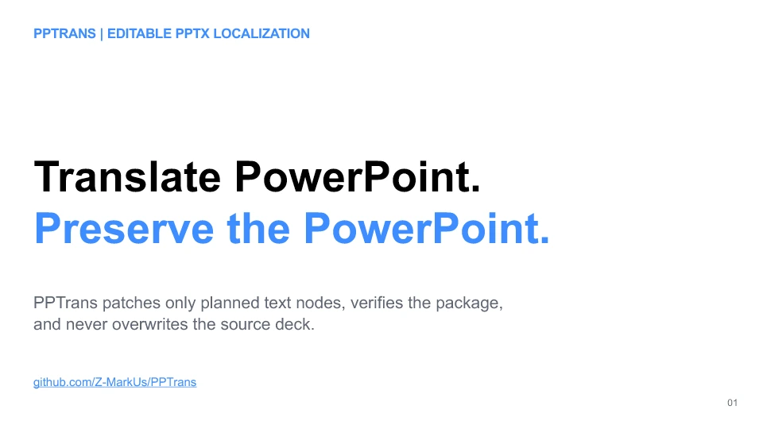
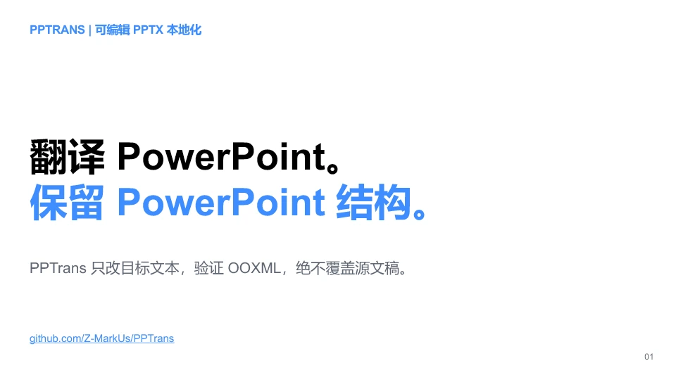
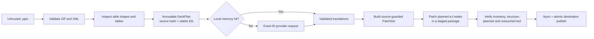

# PPTrans

**Translate editable PowerPoint decks by changing only the intended text nodes—then verify the package before publishing the output.**

[简体中文](README.zh-CN.md)

## 60-second overview

- **Outcome:** translates editable slide text at existing DrawingML `a:t` boundaries while retaining the surrounding package structure and formatting objects.
- **Integrity:** binds work to the source SHA-256 and stable unit/span addresses, patches a staged copy, verifies planned and untouched content, then publishes atomically.
- **Untrusted-AI boundary:** OpenAI and Anthropic results must satisfy strict schemas and exact IDs; partial, reordered, duplicated, or invented output fails closed.
- **Automation gate:** `--fail-on-warnings` can stop a run on recognized unsupported slide content before a provider is constructed or an output is published.
- **Privacy and security:** defensive ZIP/XML/resource limits; only selected text and context reach the explicitly chosen provider—not the deck binary, media, or raw XML.
- **Evidence:** 413 passing tests, 91.95% combined branch-aware coverage in the latest local audit, 9,346 generated property examples, cross-platform CI configuration, packaging checks, and security scanning.
- **Runnable proof:** a synthetic 3-slide / 41-unit / 45-span demo, a real changed-text zh-CN output, and scoped LibreOffice acceptance evidence.

### Before / after: the text really changes

| English source | Curated Simplified Chinese output |
| --- | --- |
|  |  |

Download the [English source deck](examples/pptrans-demo.en.pptx) and the [verified zh-CN output](examples/pptrans-demo.zh-CN.pptx), or inspect the deterministic [fixture generator](scripts/build_curated_demo.py). The target strings are author-reviewed fixture data routed through the real exact-ID patch/verify/publish pipeline; this demonstrates changed OOXML and preservation behavior, not production-provider translation quality. All three before/after slides and their native QA scope are in the [demo notes](docs/DEMO.md).

## My role and contributions

PPTrans is maintained by Hehan Zhao. For v2, I defined the product direction and safety bar and led the current end-to-end re-architecture: defensive OOXML inspection, stable-ID provider contracts, transactional patch/verify/publish behavior, deterministic tests and CI, and the public demo. I do not present the repository history as clean-room work; imported-upstream provenance remains documented in [NOTICE.md](NOTICE.md) and currently blocks another release.

## Version status

| Track | Status | Meaning | Recommended use |
| --- | --- | --- | --- |
| v1.1.x | Published legacy release | Earlier implementation; it does not represent the v2 integrity architecture | Historical reference only |
| v2 / `2.0.0a1` | Unreleased showcase work | Current architecture, tests, changed-text demo, and native QA | Evaluate from source; not a published package |

> [!IMPORTANT]
> `2.0.0a1` is unreleased development work. Install it from source for evaluation. Package publication and another release are blocked by the unresolved provenance/licensing issue documented in [NOTICE.md](NOTICE.md).

## Architecture: a verified text-patch transaction



The source remains read-only. Verification checks package inventory, unrelated member bytes, the structural fingerprint of changed slides, and every planned and untouched text node before an atomic no-clobber publish. Detailed limits and failure behavior live in the [architecture](docs/ARCHITECTURE.md) and [threat model](docs/THREAT_MODEL.md).

## What is—and is not—translated

| Presentation content | v2 behavior |
| --- | --- |
| Regular text in slide-local shapes | Translated at existing DrawingML `a:t` boundaries |
| Multiple paragraphs and styled runs | Boundaries and structure retained; text values may change |
| Text in nested group shapes | Translated through nested non-visual shape-ID paths |
| DrawingML table-cell text | Translated without rebuilding the table |
| Generated fields such as dates | Preserved and integrity-checked, but locked from translation |
| Charts and SmartArt/diagram text | Package content preserved; text not translated |
| Notes, comments, masters/layouts, alt text, embedded objects, image text | Preserved where present; not translated |
| Longer text and layout fit | No automatic font resizing, box expansion, or overflow repair |
| `.ppt`, `.pptm`, `.ppsx`, `.potx` | Rejected; the translation engine accepts validated `.pptx` only |
| Visual review and repair | Safety-oriented schemas, policies, budgets, and LibreOffice renderer exist; no end-to-end review provider, CLI workflow, or repair executor yet |

Structural preservation does not prove visual fit. A valid translation can still wrap, clip, or render differently because of text expansion, fonts, language shaping, or the viewing application. Review output in the target presentation application. The detailed boundary is in [known limitations](docs/LIMITATIONS.md).

## Five-minute source quickstart

PPTrans v2 is unreleased, and the audited v2 tree is not yet public while its provenance gate remains unresolved. These commands assume this v2 source tree is already checked out, a supported CPython 3.10–3.13 is installed, and your shell is at the repository root.

Create a virtual environment:

```bash
python -m venv .venv
```

Activate the environment:

```bash
# macOS / Linux
source .venv/bin/activate

# Windows PowerShell
.\.venv\Scripts\Activate.ps1
```

Install the development environment, check runtime readiness, and inspect the committed demo without exposing its text:

```bash
python -m pip install --upgrade pip
python -m pip install -e ".[dev]"
pptrans doctor
pptrans inspect examples/pptrans-demo.en.pptx --source en --target en --fail-on-warnings
```

Inspection warnings are non-fatal by default. Here, `--fail-on-warnings` makes `inspect` return status 1 if PPTrans reports unsupported content. The same option on `translate` stops before output preflight, provider construction, translation-memory access, or publication. It does not guarantee that every unsupported PowerPoint feature is detected or prove visual fit.

Then exercise the complete transaction offline:

```bash
pptrans translate examples/pptrans-demo.en.pptx --source en --target en --provider identity --no-memory --fail-on-warnings --output pptrans-demo.identity.pptx --json
```

`identity` is a no-op provider for proving the offline transaction; the curated zh-CN fixture proves actual changed text. Both are pinned by integration tests and scoped native records. See the [complete demo and QA notes](docs/DEMO.md).

## Translate with a provider

Export the provider credential or pass an explicit `--env-file`; PPTrans never searches for dotenv files or chooses a paid model implicitly.

```bash
pptrans translate examples/pptrans-demo.en.pptx --source en --target zh-CN --provider openai --model <explicit-model-name> --env-file .env --glossary examples/glossary.example.yaml --fail-on-warnings --output pptrans-demo.zh-CN.pptx
```

Anthropic uses `--provider anthropic` and `ANTHROPIC_API_KEY`. `--no-memory` disables local retention; `--style`, `--glossary`, and `--json` expose the main controls. Paid work is preflighted against unit, call, source/context, and serialized-request ceilings. The strict warning option blocks only diagnostics PPTrans actually emits; it is not an exhaustive feature-support check. See [provider integration](docs/PROVIDERS.md) for the complete CLI, routing, and cost boundaries.

### Provider contract and privacy

| Adapter | Contract | Credential |
| --- | --- | --- |
| OpenAI | Responses API with strict JSON Schema; requests set `store=False` | `OPENAI_API_KEY` |
| Anthropic | Messages API with exactly one forced schema tool call | `ANTHROPIC_API_KEY` |
| Identity | Offline, deterministic pass-through for pipeline verification | None |

The provider request includes selected slide text, adjacent paragraph context, source/target language, optional style, and glossary terms. It excludes the `.pptx` binary, file path, raw XML, formatting, images, notes, relationships, and embedded files. Selected text is still a data export: obtain authorization and review the provider's retention terms before processing sensitive content.

The default translation memory is local, persistent, and **unencrypted** SQLite. Use `--no-memory` for sensitive work. Cache identity, permissions, journaling, endpoint pinning, proxy behavior, and caller-injected client responsibilities are documented in [provider integration](docs/PROVIDERS.md) and [security policy](SECURITY.md).

## Evidence, not slogans

The repository's quality claims are scoped to checks that actually run:

- [Core, safety, and property tests](tests/) cover rich OOXML fixtures, malicious packages, stale sources, unplanned changes, and 9,346 generated Unicode/order/path/mutation examples.
- [Provider contract tests](tests/test_provider_adapters.py) inject SDK clients and exercise strict schemas and safe error mapping without network access.
- [Review-foundation tests](tests/test_security_review_foundation.py) scan the v2 package for dynamic execution calls and test renderer/image safety boundaries.
- [Public-demo tests](tests/test_public_demo.py) pin byte-reproducible decks, exact changed members, and the complete contents of both scoped [identity](docs/qa/2026-08-28-windows-libreoffice.json) and [changed-text](docs/qa/2026-08-28-curated-zh-cn.json) native records. The native renders and visual judgments are recorded manual acceptance evidence; the test suite does not recreate those observations.
- [CI and security workflows](.github/workflows/) configure linting, strict typing, coverage, packaging, multi-OS tests, Bandit, dependency audit, CodeQL, and full-history secret scanning with SHA-pinned actions plus a checksum-pinned scanner archive.

The configured combined branch-aware coverage floor is visible in [pyproject.toml](pyproject.toml). A successful workflow is evidence for its exact workflow and commit only; it is not proof of universal formatting preservation or translation quality. Public badges will be restored only after the audited v2 workflows are published and pass on the public repository.

### Benchmark status

On Windows 11 with Python 3.12.13, the committed synthetic deck completed the deterministic `inspect → identity orchestration → patch → verify` core in a **57.369 ms median** and **65.65 ms p95** over 30 measured iterations after 3 warmups. The run came from clean commit `4fb51de`, used the 18,687-byte fixture with 3 slides / 41 units / 45 spans, and records its full SHA, environment, command, and timings in the [raw benchmark result](benchmarks/results/2026-08-31-windows-python312.json).

This is a narrow local core benchmark, not a provider, network, translation-memory, LibreOffice, rendering, cost, or translation-quality result, and it does not establish maximum practical deck size or cross-machine performance. See the [benchmark method](benchmarks/README.md) and [quality gates](docs/QUALITY_GATES.md).

## Optional review foundation

Installing `.[review]` adds a bounded LibreOffice → PDF → PNG renderer plus typed review/repair schemas and budgets. Renderer cleanup is a publication barrier: source snapshots, PDF, profile, and rasters must be retired before final images appear, and failures roll back owned outputs. This is foundation code—not a multimodal review workflow, PowerPoint-equivalence guarantee, or repair executor. See the [architecture](docs/ARCHITECTURE.md).

## Built for Codex and Claude Code

PPTrans includes repository-native guidance so coding agents inherit the same invariants as human contributors:

- [AGENTS.md](AGENTS.md) defines architecture, safety, testing, and Git rules.
- [.agents/skills/pptrans-engineering/](.agents/skills/pptrans-engineering/) is the canonical Codex Agent Skill. Invoke it as `$pptrans-engineering`.
- [.claude/skills/pptrans-engineering/](.claude/skills/pptrans-engineering/) is a generated byte-identical Claude Code mirror. Invoke it as `/pptrans-engineering`.
- [CLAUDE.md](CLAUDE.md) imports the repository guidance, while deterministic sync and validation scripts prevent the two skill copies from drifting.

The skill routes OOXML, verification, provider, benchmark, and release tasks to focused references and explicitly forbids unsupported claims or model-generated code execution.

## Project map

```text
src/pptrans/
├── domain/              immutable plans, locators, spans, patches, reports
├── ooxml/               safe package inspection, location, patching, verification
├── ports/               provider and translation-memory protocols
├── application/         translation and deck transaction orchestration
├── adapters/
│   ├── providers/       OpenAI, Anthropic, offline identity
│   ├── renderers/       optional LibreOffice/PDF/PNG foundation
│   └── sqlite_memory.py local semantic translation cache
├── schemas/             strict untrusted translation/review payloads
├── review/              budgets, privacy policy, allowlisted repair plans
└── cli.py               inspect, translate, doctor
```

## Engineering documentation

- [Architecture](docs/ARCHITECTURE.md)
- [Providers and data boundary](docs/PROVIDERS.md)
- [Known limitations](docs/LIMITATIONS.md)
- [Threat model](docs/THREAT_MODEL.md)
- [Security policy](SECURITY.md)
- [Quality gates](docs/QUALITY_GATES.md)
- [Public demo source and QA](docs/DEMO.md)
- [Contributing](CONTRIBUTING.md)
- [Unreleased changelog](CHANGELOG.md)
- [Provenance and licensing notice](NOTICE.md)

## Contributing and release status

Contributions should use synthetic fixtures, deterministic provider doubles, and the applicable [quality gates](docs/QUALITY_GATES.md). Do not commit credentials, private presentations, provider payloads containing user data, generated customer content, or translation-memory databases.

The Git history includes imported upstream material with strong but incomplete evidence of MIT licensing: upstream asserted MIT before its first source commit and repeated that assertion in the exact snapshot imported here, but the referenced root license was absent; a full MIT text appeared later only beside a nested skill copy. The current engineering work does not erase that provenance or establish redistribution rights. Read [NOTICE.md](NOTICE.md) before reusing, packaging, or releasing this repository; it records the factual timeline and is not legal advice.
