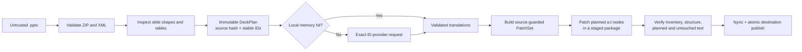
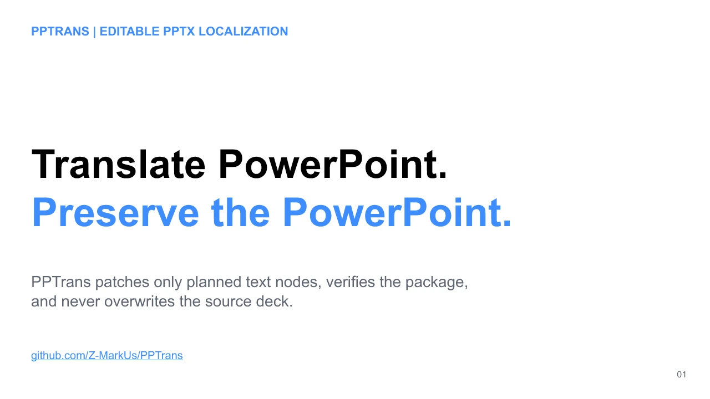

# PPTrans

**Translate editable PowerPoint decks by changing only the intended text nodes—then verify the package before publishing the output.**

[简体中文](README.zh-CN.md)

[](https://github.com/Z-MarkUs/PPTrans/actions/workflows/ci.yml)
[](https://github.com/Z-MarkUs/PPTrans/actions/workflows/security.yml)

PPTrans v2 treats a `.pptx` as an OOXML transaction, not a bag of strings. It inspects the original package, addresses text through stable shape and span IDs, accepts only schema-valid provider output, patches a staged copy, proves that unrelated content stayed unchanged, and atomically publishes a distinct presentation.

The result is an engineering showcase in document integrity, untrusted AI-output handling, provider abstraction, local caching, defensive parsing, deterministic testing, and developer tooling—not a claim of universal PowerPoint compatibility.

> [!IMPORTANT]
> `2.0.0a1` is unreleased development work. Install it from source for evaluation. Package publication and another release are blocked by the unresolved provenance/licensing issue documented in [NOTICE.md](NOTICE.md).

## What this project demonstrates

- **Data integrity:** source SHA-256 guards, per-unit source digests, copy-on-write OOXML patching, post-write structural verification, and a source path that can never be the destination.
- **Safe AI integration:** OpenAI and Anthropic adapters return strict structured data; missing, invented, duplicated, partial, or reordered unit/span IDs fail closed.
- **Clean boundaries:** immutable domain models, provider and memory ports, application services, SDK adapters, and a CLI built around explicit failure states.
- **Practical privacy:** only selected text/context is sent to a chosen provider; deck binaries, raw XML, media, and formatting are not uploaded by the translation path.
- **Bounded work:** archive structure, parsed XML, discovered text, provider units/calls, and serialized request volume all have explicit fail-closed ceilings.
- **Testable engineering:** offline fake providers, self-authored PPTX fixtures, malicious-input tests, an executable public demo, cross-platform CI configuration, and security scanning.
- **Agent-ready maintenance:** repository instructions and a synchronized engineering skill for Codex and Claude Code.

## Architecture: a verified text-patch transaction



The source presentation is read-only throughout. Verification checks ZIP integrity and member ordering, requires unrelated package members to retain identical payloads, compares a canonical structural fingerprint for changed slide XML, and confirms every planned and unplanned text node. A failed stage is deleted. Default publication is atomic and refuses to clobber a destination that appears during the run; replacement happens only with explicit `--overwrite`.

See the full [architecture](docs/ARCHITECTURE.md) and [threat model](docs/THREAT_MODEL.md).

Default package policy rejects more than 500 slides, 250,000 XML elements in one inspected slide part, 10,000 translation units, 50,000 text spans, 5,000,000 discovered source characters, 10,000 translatable spans in one unit, 100,000 source characters in one translatable span, or 10,000 accumulated diagnostics. These semantic limits sit alongside ZIP/member/XML expansion limits and are intentionally conservative denial-of-service boundaries, not PowerPoint capability claims.

## What is—and is not—translated

| Presentation content | v2 behavior |
| --- | --- |
| Regular text in slide-local shapes | Translated at existing DrawingML `a:t` boundaries |
| Multiple paragraphs and styled runs | Boundaries and structure retained; text values may change |
| Text in nested group shapes | Translated through nested non-visual shape-ID paths |
| DrawingML table-cell text | Translated without rebuilding the table |
| Generated fields such as dates | Preserved and integrity-checked, but locked from translation |
| Charts and SmartArt/diagram text | Package content preserved; text not translated |
| Notes, comments, masters/layouts, alt text, embedded objects, image text | Preserved where present; not translated |
| Longer text and layout fit | No automatic font resizing, box expansion, or overflow repair |
| `.ppt`, `.pptm`, `.ppsx`, `.potx` | Rejected; the translation engine accepts validated `.pptx` only |
| Visual review and repair | Safety-oriented schemas, policies, budgets, and LibreOffice renderer exist; no end-to-end review provider, CLI workflow, or repair executor yet |

Structural preservation does not prove visual fit. A valid translation can still wrap, clip, or render differently because of text expansion, fonts, language shaping, or the viewing application. Review output in the target presentation application. The detailed boundary is in [known limitations](docs/LIMITATIONS.md).

## Five-minute source quickstart

PPTrans v2 is intentionally not advertised as a PyPI or binary release. Run the current alpha from a checkout:

```bash
git clone https://github.com/Z-MarkUs/PPTrans.git
cd PPTrans
python -m venv .venv
```

Activate the environment:

```bash
# macOS / Linux
source .venv/bin/activate

# Windows PowerShell
.\.venv\Scripts\Activate.ps1
```

Install the development environment and inspect the public demo without exposing its text:

```bash
python -m pip install --upgrade pip
python -m pip install -e ".[dev]"
pptrans doctor
pptrans inspect examples/pptrans-demo.en.pptx --source en --target en
```

Then exercise the complete transaction offline:

```bash
pptrans translate examples/pptrans-demo.en.pptx --source en --target en --provider identity --no-memory --output pptrans-demo.identity.pptx --json
```



`identity` is deliberately not a translator: it returns each source span unchanged. This demo proves inspection, exact-ID orchestration, patch construction, staging, verification, and output publication without a network call or API key. The committed integration test currently asserts 3 slides, 41 translation units, 45 verified spans, zero inspection warnings, normalized author-owned metadata, and a successful independent `python-pptx` reopen in [tests/test_public_demo.py](tests/test_public_demo.py).

The same source and identity output were also accepted by LibreOffice 26.8.0.3 on Windows at commit `37733fa`: both packages were byte-identical, all three 1921 × 1080 render pairs had matching SHA-256 values and pixel buffers, every slide passed visual and automated overflow review, and the renderer left no private workspace or helper process behind. The [machine-readable native QA record](docs/qa/2026-08-28-windows-libreoffice.json) carries the exact versions, hashes, dimensions, and scope. This is LibreOffice evidence for one synthetic fixture—not a translation-quality result or a claim of pixel identity with Microsoft PowerPoint. See [demo source, rebuild, and QA notes](docs/DEMO.md).

## Translate with a provider

Either export the provider credential or copy [.env.example](.env.example) to `.env` and pass `--env-file .env`. PPTrans never discovers dotenv files implicitly and has no hidden paid-model default. Built-in adapters pin the official provider endpoint, reject ambient `*_BASE_URL` or `*_CUSTOM_HEADERS` SDK routing overrides, and construct their HTTP clients with `trust_env=False` so environment proxy and TLS-routing settings are not inherited. An explicitly injected Python SDK client is caller-owned and outside that default.

```bash
pptrans translate examples/pptrans-demo.en.pptx --source en --target zh-CN --provider openai --model <explicit-model-name> --env-file .env --glossary examples/glossary.example.yaml --output pptrans-demo.zh-CN.pptx
```

Use `--provider anthropic` with `ANTHROPIC_API_KEY` for the Anthropic adapter. Use `--no-memory` to disable local persistence, `--memory <path>` to select a cache, `--style <instruction>` for an audience/tone constraint, and `--json` for a machine-readable completion report. Machine JSON is compact, ASCII-escaped, and written without Rich styling; human-facing values escape every Unicode `Cc` control character as visible `\uXXXX` text (except intentional newlines in inspected text). Run `pptrans --help` for the implemented CLI surface.

The CLI conservatively preflights the complete plan before constructing a paid-provider client, then rechecks only cache misses. Defaults allow at most 2,000 provider units (`--max-provider-units`), 100 logical provider calls (`--max-provider-calls`; SDK retries are separate), 2,000,000 source/context characters (`--max-provider-source-characters`), and 5,000,000 serialized request characters across all logical batches (`--max-provider-request-characters`). Every individual serialized request is independently capped at 1,000,000 characters. Raising a ceiling is an explicit cost/risk decision, not a claim that the deck will translate well.

### Provider contract and privacy

| Adapter | Contract | Credential |
| --- | --- | --- |
| OpenAI | Responses API with strict JSON Schema; requests set `store=False` | `OPENAI_API_KEY` |
| Anthropic | Messages API with exactly one forced schema tool call | `ANTHROPIC_API_KEY` |
| Identity | Offline, deterministic pass-through for pipeline verification | None |

The provider request includes selected slide text, adjacent paragraph context, source/target language, optional style, and glossary terms. It excludes the `.pptx` binary, file path, raw XML, formatting, images, notes, relationships, and embedded files. Selected text is still a data export: obtain authorization and review the provider's retention terms before processing sensitive content.

The default translation memory is a local, persistent, **unencrypted** SQLite database. Its semantic key includes languages, provider/model, a fingerprint derived from the exact provider instructions and response schema, style, glossary, adjacent context, source strings, span kinds, order, and segmentation. Cache-path symlink leaves are rejected. On POSIX, newly created cache directories request mode `0700` and a new database requests `0600`; existing permissions/ACLs are preserved, Windows relies on inherited ACLs, and neither behavior is an ACL audit. SQLite is forced to `DELETE` journaling so successful runs do not retain WAL/SHM sidecars, though a plaintext rollback journal can exist during a transaction or after a crash. Use `--no-memory` when plaintext local retention is inappropriate. Details are in [provider integration](docs/PROVIDERS.md) and [security policy](SECURITY.md).

## Evidence, not slogans

The repository's quality claims are scoped to checks that actually run:

- [OOXML core tests](tests/test_ooxml_core.py) use self-authored decks with mixed styling, hyperlinks, fields, merged/formatted tables, nested groups, rotations, and multiple slides.
- [Safety tests](tests/test_ooxml_safety.py) cover stale sources, malicious archive paths, duplicate members, signature rejection, unplanned text changes, unrelated-part changes, and unsafe destinations.
- [Deterministic property tests](tests/test_properties.py) exercise 9,346 generated examples across XML 1.0 character boundaries, Unicode serialization fidelity, provider span ordering, relationship-target containment, and byte-mutated PPTX handling.
- [Provider contract tests](tests/test_provider_adapters.py) inject SDK clients and exercise strict schemas and safe error mapping without network access.
- [Review-foundation tests](tests/test_security_review_foundation.py) scan the v2 package for dynamic execution calls and test renderer/image safety boundaries.
- [The public demo test](tests/test_public_demo.py) keeps the committed PPTX synchronized with the real offline pipeline.
- [The native renderer acceptance record](docs/qa/2026-08-28-windows-libreoffice.json) ties one complete Windows/LibreOffice run to a commit, fixture digest, exact renderer versions, per-slide hashes, pixel comparison, visual review, overflow review, and cleanup checks.
- [CI](.github/workflows/ci.yml) is configured for linting, formatting, strict typing, branch coverage, Bandit, dependency audit, skill validation, and package checks on Python 3.12, plus deterministic tests on Linux, Windows, and macOS at Python 3.10 and 3.13.
- [Security automation](.github/workflows/security.yml) configures CodeQL, full-history secret scanning, and a weekly schedule; actions are pinned to commit SHAs.

The configured branch-coverage floor is visible in [pyproject.toml](pyproject.toml). A green badge is useful evidence for its workflow and commit only; it is not proof of universal formatting preservation or translation quality.

### Benchmark status

On Windows 11 with Python 3.12.13, the committed synthetic deck completed the deterministic `inspect → identity orchestration → patch → verify` core in a **59.998 ms median** and **66.442 ms p95** over 30 measured iterations after 3 warmups. The run came from clean commit `dd39e55`, used the 18,687-byte fixture with 3 slides / 41 units / 45 spans, and records its full SHA, environment, command, and timings in the [raw benchmark result](benchmarks/results/2026-08-28-windows-python312.json).

This is a narrow local core benchmark, not a provider, network, translation-memory, LibreOffice, rendering, cost, or translation-quality result, and it does not establish maximum practical deck size or cross-machine performance. See the [benchmark method](benchmarks/README.md) and [quality gates](docs/QUALITY_GATES.md).

## Optional review foundation

Installing `.[review]` adds PyMuPDF support for a local LibreOffice → PDF → bounded PNG renderer. Its explicit Impress PDF export includes hidden slides so page-count verification covers the full deck. Rendering uses separate private and publication workspaces: bounded cleanup retries must retire the source snapshot, PDF, raster workspace, and isolated LibreOffice profile before any final image is linked into place; cleanup or publication failures fail closed and roll back owned outputs. The repository also contains strict issue schemas, deterministic local score/pass evaluation, privacy modes, endpoint checks, log redaction, request/pixel/token/repair budgets, and typed allowlisted repair plans.

These are reviewed building blocks, not a completed visual-review product. There is no multimodal review-provider adapter, CLI review command, PowerPoint-equivalent rendering guarantee, or repair executor in v2 today. LibreOffice is a separate system dependency and should be isolated at the OS level when opening untrusted decks.

## Built for Codex and Claude Code

PPTrans includes repository-native guidance so coding agents inherit the same invariants as human contributors:

- [AGENTS.md](AGENTS.md) defines architecture, safety, testing, and Git rules.
- [.agents/skills/pptrans-engineering/](.agents/skills/pptrans-engineering/) is the canonical Codex Agent Skill. Invoke it as `$pptrans-engineering`.
- [.claude/skills/pptrans-engineering/](.claude/skills/pptrans-engineering/) is a generated byte-identical Claude Code mirror. Invoke it as `/pptrans-engineering`.
- [CLAUDE.md](CLAUDE.md) imports the repository guidance, while deterministic sync and validation scripts prevent the two skill copies from drifting.

The skill routes OOXML, verification, provider, benchmark, and release tasks to focused references and explicitly forbids unsupported claims or model-generated code execution.

## Project map

```text
src/pptrans/
├── domain/              immutable plans, locators, spans, patches, reports
├── ooxml/               safe package inspection, location, patching, verification
├── ports/               provider and translation-memory protocols
├── application/         translation and deck transaction orchestration
├── adapters/
│   ├── providers/       OpenAI, Anthropic, offline identity
│   ├── renderers/       optional LibreOffice/PDF/PNG foundation
│   └── sqlite_memory.py local semantic translation cache
├── schemas/             strict untrusted translation/review payloads
├── review/              budgets, privacy policy, allowlisted repair plans
└── cli.py               inspect, translate, doctor
```

## Engineering documentation

- [Architecture](docs/ARCHITECTURE.md)
- [Providers and data boundary](docs/PROVIDERS.md)
- [Known limitations](docs/LIMITATIONS.md)
- [Threat model](docs/THREAT_MODEL.md)
- [Security policy](SECURITY.md)
- [Quality gates](docs/QUALITY_GATES.md)
- [Public demo source and QA](docs/DEMO.md)
- [Contributing](CONTRIBUTING.md)
- [Unreleased changelog](CHANGELOG.md)
- [Provenance and licensing notice](NOTICE.md)

## Contributing and release status

Contributions should use synthetic fixtures, deterministic provider doubles, and the applicable [quality gates](docs/QUALITY_GATES.md). Do not commit credentials, private presentations, provider payloads containing user data, generated customer content, or translation-memory databases.

The Git history includes imported upstream material with strong but incomplete evidence of MIT licensing: upstream asserted MIT before its first source commit and repeated that assertion in the exact snapshot imported here, but the referenced root license was absent; a full MIT text appeared later only beside a nested skill copy. The current engineering work does not erase that provenance or establish redistribution rights. Read [NOTICE.md](NOTICE.md) before reusing, packaging, or releasing this repository; it records the factual timeline and is not legal advice.
