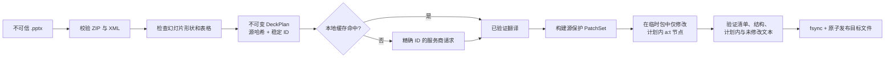

# PPTrans

**只替换目标文本节点来翻译可编辑 PowerPoint，并在发布输出前验证整个 OOXML 包。**

[English](README.md) | 简体中文

[](https://github.com/Z-MarkUs/PPTrans/actions/workflows/ci.yml)
[](https://github.com/Z-MarkUs/PPTrans/actions/workflows/security.yml)

PPTrans v2 把 `.pptx` 当作一次可验证的 OOXML 事务，而不是一组字符串。它检查原始包，通过稳定的形状与文本片段 ID 定位内容，只接受符合严格结构的模型输出，在临时副本中打补丁，证明无关内容未改变，最后原子发布一个独立的演示文稿。

这个项目展示的是文档完整性、不可信 AI 输出处理、服务商抽象、本地缓存、防御式解析、确定性测试和开发者工具链；它不宣称兼容所有 PowerPoint 功能。

> [!IMPORTANT]
> `2.0.0a1` 仍是未发布的开发版本，请从源码安装评估。由于 [NOTICE.md](NOTICE.md) 记录的来源与上游许可问题尚未解决，目前不得发布新软件包或新版本。

## 项目体现的工程能力

- **数据完整性：** 源文件 SHA-256、每个翻译单元的源摘要、写时复制、写后结构验证，并禁止把源文件作为输出路径。
- **安全的 AI 集成：** OpenAI 与 Anthropic 只返回严格结构化数据；缺失、伪造、重复、不完整或顺序错误的单元/片段 ID 都会失败关闭。
- **清晰分层：** 不可变领域模型、provider/memory 接口、应用服务、SDK 适配器，以及显式处理失败状态的 CLI。
- **隐私边界：** 翻译流程只向所选服务商发送必要文本和上下文，不上传 PPTX 二进制、原始 XML、媒体或格式信息。
- **工作量有界：** 压缩包结构、解析 XML、发现文本、服务商单元/调用次数和序列化请求量都有显式、失败关闭的上限。
- **可验证测试：** 离线假服务商、自建 PPTX fixture、恶意输入测试、可执行公开 demo、跨平台 CI 配置和安全扫描。
- **Agent 工程化：** Codex 与 Claude Code 共用同一套仓库规则和同步校验的工程 skill。

## 架构：可验证的文本补丁事务



源演示文稿始终只读。验证会检查 ZIP 完整性和成员顺序，要求无关包成员保持相同内容，对变化的幻灯片 XML 比较规范化结构指纹，并核对所有计划内及计划外文本节点。任一步失败都会删除临时文件。默认发布使用原子且禁止覆盖的路径；运行中若出现同名目标会失败，只有显式使用 `--overwrite` 才会替换。

详细设计见[架构文档](docs/ARCHITECTURE.md)与[威胁模型](docs/THREAT_MODEL.md)。

默认包策略会拒绝超过 500 张幻灯片、单个被检查的幻灯片 XML part 超过 250,000 个元素、超过 10,000 个翻译单元、50,000 个文本片段、5,000,000 个已发现源字符、单个单元超过 10,000 个可翻译片段、单个可翻译片段超过 100,000 个源字符，或累计超过 10,000 条诊断信息的输入。这些语义上限与 ZIP/member/XML 解压上限共同构成保守的拒绝服务边界，并不代表 PowerPoint 本身的能力范围。

## 支持与不支持的内容

| 演示文稿内容 | v2 行为 |
| --- | --- |
| 幻灯片内普通形状文本 | 在现有 DrawingML `a:t` 边界上翻译 |
| 多段落和带格式的 runs | 保留边界与结构，只更改文本值 |
| 多层组合形状内文本 | 通过嵌套的非可视形状 ID 定位并翻译 |
| DrawingML 表格单元格文本 | 不重建表格，直接翻译现有节点 |
| 日期等生成字段 | 保留并验证完整性，不作为翻译目标 |
| 图表与 SmartArt/diagram 文本 | 保留包内容，但不翻译其中的文本 |
| 备注、评论、母版/版式、替代文本、嵌入对象、图片文字 | 原样保留，但不翻译 |
| 长文本与版面适配 | 不会自动缩小字体、扩大文本框或修复溢出 |
| `.ppt`、`.pptm`、`.ppsx`、`.potx` | 拒绝；翻译引擎只接受通过校验的 `.pptx` |
| 视觉审查与修复 | 已有安全 schema、策略、预算和 LibreOffice renderer 基础；尚无端到端服务商、CLI 工作流或修复执行器 |

结构保持并不等于视觉适配。翻译后仍可能因文字膨胀、字体、语言 shaping 或查看软件不同而换行、裁切或错位。请在目标演示软件中检查输出，完整边界见[已知限制](docs/LIMITATIONS.md)。

## 五分钟源码快速体验

v2 当前不作为 PyPI 包或独立二进制版本宣传，请从源码运行：

```bash
git clone https://github.com/Z-MarkUs/PPTrans.git
cd PPTrans
python -m venv .venv
```

激活虚拟环境：

```bash
# macOS / Linux
source .venv/bin/activate

# Windows PowerShell
.\.venv\Scripts\Activate.ps1
```

安装开发环境，并在默认不显示文本的情况下检查公开 demo：

```bash
python -m pip install --upgrade pip
python -m pip install -e ".[dev]"
pptrans doctor
pptrans inspect examples/pptrans-demo.en.pptx --source en --target en
```

随后离线执行完整事务：

```bash
pptrans translate examples/pptrans-demo.en.pptx --source en --target en --provider identity --no-memory --output pptrans-demo.identity.pptx --json
```


`identity` 并不翻译，而是原样返回每个源文本片段。这个 demo 无需网络或 API key，即可验证检查、精确 ID 编排、补丁构建、临时写入、验证和输出发布。当前 [tests/test_public_demo.py](tests/test_public_demo.py) 明确断言：3 张幻灯片、41 个翻译单元、45 个已验证文本片段、零检查警告、规范化的作者自有元数据，并能由独立的 `python-pptx` 成功重新打开。上图是渲染 QA 产物，不代表与 PowerPoint 像素一致。源文件、重建与 QA 说明见[公开 demo 文档](docs/DEMO.md)。

## 使用真实服务商翻译

可以导出服务商凭证；也可以把 [.env.example](.env.example) 复制为 `.env`，并显式传入 `--env-file .env`。PPTrans 不会自动搜索 dotenv 文件，也不会暗中选择付费模型。内置适配器固定使用服务商官方 endpoint，拒绝环境中的 `*_BASE_URL` 与 `*_CUSTOM_HEADERS` SDK 路由覆盖，并以 `trust_env=False` 构造 HTTP client，因此不会继承环境代理与 TLS 路由设置。Python 调用方显式注入的 SDK client 由调用方负责，不受此默认值约束。

```bash
pptrans translate examples/pptrans-demo.en.pptx --source en --target zh-CN --provider openai --model <明确的模型名称> --env-file .env --glossary examples/glossary.example.yaml --output pptrans-demo.zh-CN.pptx
```

Anthropic 适配器使用 `--provider anthropic` 和 `ANTHROPIC_API_KEY`。`--no-memory` 可关闭本地持久化，`--memory <路径>` 可指定缓存文件，`--style <说明>` 可添加受众/语气要求，`--json` 可输出机器可读报告。机器 JSON 使用紧凑格式、ASCII 转义且不经过 Rich；人类可读输出会把所有 Unicode `Cc` 控制字符显示为 `\uXXXX`（检查文本中有意保留的换行除外）。以 `pptrans --help` 为当前已实现的 CLI 准则。

CLI 会在构造付费服务商 client 前保守检查完整计划，缓存查询后再只对未命中部分复核。默认最多允许 2,000 个服务商单元（`--max-provider-units`）、100 次逻辑服务商调用（`--max-provider-calls`；SDK 内部重试另计）、2,000,000 个源文本/上下文字符（`--max-provider-source-characters`），以及所有逻辑批次合计 5,000,000 个序列化请求字符（`--max-provider-request-characters`）。每个单独请求还独立限制为 1,000,000 字符。提高上限意味着显式接受成本与风险，并不保证大 deck 的翻译效果。

### 服务商契约与隐私

| 适配器 | 结构契约 | 凭证 |
| --- | --- | --- |
| OpenAI | Responses API 严格 JSON Schema；请求设置 `store=False` | `OPENAI_API_KEY` |
| Anthropic | Messages API，强制且只允许一次指定 schema tool call | `ANTHROPIC_API_KEY` |
| Identity | 完全离线、确定性透传，仅用于验证流水线 | 无 |

服务商会收到选定的幻灯片文本、相邻段落上下文、源/目标语言、可选 style 和术语表；不会收到 PPTX 二进制、文件路径、原始 XML、格式、图片、备注、关系或嵌入文件。但文本本身仍是数据导出，处理敏感材料前必须获得授权并检查服务商的数据保留条款。

默认翻译记忆库是本地、持久化且**未加密**的 SQLite 数据库。其语义 key 包含语言、服务商/模型、由精确服务商指令与响应 schema 计算的契约指纹、style、术语表、相邻上下文、源文本、片段类型、顺序与切分。缓存路径的符号链接叶节点会被拒绝。POSIX 上新建缓存目录请求 `0700`，新数据库请求 `0600`；已有权限/ACL 保持不变，Windows 依赖继承 ACL，这些都不等于 ACL 审计。SQLite 强制使用 `DELETE` journal，使成功运行不保留 WAL/SHM sidecar；事务期间或崩溃后仍可能存在明文 rollback journal。若不适合保留明文，请使用 `--no-memory`。详见[服务商文档](docs/PROVIDERS.md)和[安全策略](SECURITY.md)。

## 有边界的质量证据

- [OOXML 核心测试](tests/test_ooxml_core.py)使用自建 deck，覆盖混合格式、超链接、字段、合并/格式化表格、多层组合、旋转和多张幻灯片。
- [安全测试](tests/test_ooxml_safety.py)覆盖过期源文件、恶意压缩包路径、重复成员、数字签名、计划外文本变化、无关部件变化和危险输出路径。
- [服务商契约测试](tests/test_provider_adapters.py)注入 SDK client，在不联网的情况下检查严格 schema 与安全错误映射。
- [审查基础安全测试](tests/test_security_review_foundation.py)扫描 v2 包中的动态执行调用，并验证 renderer/图片边界。
- [公开 demo 测试](tests/test_public_demo.py)确保仓库中的 PPTX 始终与真实离线流水线同步。
- [CI](.github/workflows/ci.yml)在 Python 3.12 上配置了 lint、格式、严格类型检查、分支覆盖率、Bandit、依赖审计、skill 校验与构建检查，并在 Python 3.10 和 3.13 的 Linux、Windows、macOS 上运行确定性测试。
- [安全工作流](.github/workflows/security.yml)配置了 CodeQL、完整 Git 历史 secret scan 和每周定时任务；Actions 均固定到 commit SHA。

[pyproject.toml](pyproject.toml) 中可查看配置的分支覆盖率下限。绿色 badge 只代表对应工作流和 commit 的结果，不代表所有 PowerPoint 格式或翻译质量都已被证明。

### Benchmark 状态

目前没有公开宣称速度、成本或翻译质量数字。Benchmark gate 要求原始结果记录 commit SHA、fixture 版本、Python/操作系统版本、准确的服务商与模型、冷热缓存状态、token 用量、适用时的 renderer 版本以及完整命令。只有提供可复现产物后才会加入结果，见[质量门禁](docs/QUALITY_GATES.md)。

<!-- BENCHMARK_RESULT_PLACEHOLDER: 仅在干净工作树上生成并提交原始结果后替换。 -->

## 可选视觉审查基础

安装 `.[review]` 会加入 PyMuPDF，用于本地 LibreOffice → PDF → 有界 PNG 渲染。其显式 Impress PDF 导出会包含隐藏幻灯片，因此页数校验覆盖完整 deck。仓库也包含严格问题 schema、本地确定性评分/通过判定、隐私模式、endpoint 校验、日志脱敏、请求/像素/token/修复轮次预算，以及类型化的 allowlist 修复计划。

这些只是经过测试的基础组件，不是已完成的视觉审查产品。目前没有多模态审查服务商、CLI 审查命令、与 PowerPoint 像素等价的渲染保证或修复执行器。LibreOffice 是独立系统依赖；处理不可信 deck 时仍应使用操作系统级隔离。

## Codex 与 Claude Code 支持

- [AGENTS.md](AGENTS.md)规定架构、安全、测试与 Git 规则。
- [.agents/skills/pptrans-engineering/](.agents/skills/pptrans-engineering/) 是 Codex 的标准 skill，可用 `$pptrans-engineering` 调用。
- [.claude/skills/pptrans-engineering/](.claude/skills/pptrans-engineering/) 是字节一致的 Claude Code 生成镜像，可用 `/pptrans-engineering` 调用。
- [CLAUDE.md](CLAUDE.md)导入仓库规则；确定性的同步与校验脚本防止两份 skill 漂移。

该 skill 会把 OOXML、验证、服务商、benchmark 与 release 工作路由到针对性参考，并禁止无证据宣传或执行模型生成代码。

## 工程文档

- [架构](docs/ARCHITECTURE.md)
- [服务商与数据边界](docs/PROVIDERS.md)
- [已知限制](docs/LIMITATIONS.md)
- [威胁模型](docs/THREAT_MODEL.md)
- [安全策略](SECURITY.md)
- [质量门禁](docs/QUALITY_GATES.md)
- [公开 demo 源文件与 QA](docs/DEMO.md)
- [贡献指南](CONTRIBUTING.md)
- [未发布变更日志](CHANGELOG.md)
- [来源与许可说明](NOTICE.md)

## 贡献、来源与发布状态

贡献应使用合成 fixture、确定性 provider double，并运行适用的[质量门禁](docs/QUALITY_GATES.md)。请勿提交凭证、私人演示文稿、包含用户数据的服务商响应、生成的客户内容或翻译记忆库。

Git 历史包含从上游导入的材料，而上游许可记录存在歧义：导入前的 README 声称采用 MIT，但其引用的根目录许可证并不存在；上游后来新增的嵌套 MIT 文件又晚于本仓库的导入时间。当前工程工作不会抹去这段来源，也不能自动建立再分发权。在复用、打包或发布前必须阅读 [NOTICE.md](NOTICE.md)。该文件记录事实时间线，不构成法律意见。
