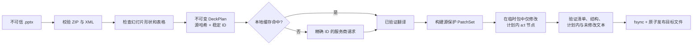

# PPTrans

**只替换目标文本节点来翻译可编辑 PowerPoint，并在发布输出前验证整个 OOXML 包。**

[English](README.md) | 简体中文

## 60 秒概览

- **结果：** 在现有 DrawingML `a:t` 边界上翻译可编辑文本，同时保留周边包结构与格式对象。
- **完整性：** 以源文件 SHA-256 和稳定的单元/片段地址绑定任务，在临时副本中修改，验证计划内与未修改内容，再原子发布。
- **不可信 AI 边界：** OpenAI 与 Anthropic 结果必须满足严格 schema 与精确 ID；缺失、乱序、重复或伪造输出都会失败关闭。
- **自动化门禁：** `--fail-on-warnings` 可在发现已识别的不支持内容时停止运行，且不会构造 provider 或发布输出。
- **隐私与安全：** 对 ZIP、XML 和资源使用量设置防御上限；只向明确选择的服务商发送必要文本与上下文，不发送 deck 二进制、媒体或原始 XML。
- **证据：** 最近一次本地审计为 455 项测试通过、含分支统计的综合覆盖率 91.95%，另有 9,346 个属性生成样例、跨平台 CI 配置、打包与文档完整性门禁，以及安全扫描。
- **可运行证明：** 3 张幻灯片 / 41 个单元 / 45 个片段的合成 demo、真实改字的简体中文输出，以及有明确边界的 LibreOffice 验收证据。

### 前后对比：文本确实发生变化

| 英文源文件 | 人工复核的简体中文输出 |
| --- | --- |
|  |  |

可下载[英文源 deck](examples/pptrans-demo.en.pptx)与[已验证的简体中文输出](examples/pptrans-demo.zh-CN.pptx)，也可查看确定性的 [fixture 生成脚本](scripts/build_curated_demo.py)。目标文本是人工复核的固定测试数据，并通过真实的精确 ID 补丁、验证与发布流水线；这证明 OOXML 确实改字且结构受到保护，不代表生产服务商的翻译质量。三张幻灯片的完整前后对比与原生 QA 边界见 [demo 说明](docs/DEMO.md)。

## 我的角色与贡献

PPTrans 由 Hehan Zhao 维护。v2 中，我确定了产品方向与安全标准，并主导当前端到端重构：防御式 OOXML 检查、稳定 ID 服务商契约、事务式补丁/验证/发布、确定性测试与 CI，以及公开 demo。我不会把整个仓库历史描述为 clean-room 原创；导入上游的来源问题已记录在 [NOTICE.md](NOTICE.md)，并且仍阻止新版本发布。

## 版本状态

| 轨道 | 状态 | 含义 | 建议用途 |
| --- | --- | --- | --- |
| v1.1.x | 已发布的旧版本 | 早期实现，不代表 v2 的完整性架构 | 仅作历史参考 |
| v2 / `2.0.0a1` | 未发布的展示版本 | 当前架构、测试、改字 demo 与原生 QA | 仅从源码评估；不是已发布软件包 |

> [!IMPORTANT]
> `2.0.0a1` 仍是未发布的开发版本，请从源码安装评估。由于 [NOTICE.md](NOTICE.md) 记录的来源与上游许可问题尚未解决，目前不得发布新软件包或新版本。

## 架构：可验证的文本补丁事务



源文件始终只读。原子且禁止覆盖的发布之前，验证会检查包清单、无关成员字节、变化幻灯片的结构指纹，以及所有计划内和未修改文本节点。完整上限与失败行为见[架构文档](docs/ARCHITECTURE.md)和[威胁模型](docs/THREAT_MODEL.md)。

## 支持与不支持的内容

| 演示文稿内容 | v2 行为 |
| --- | --- |
| 幻灯片内普通形状文本 | 在现有 DrawingML `a:t` 边界上翻译 |
| 多段落和带格式的 runs | 保留边界与结构，只更改文本值 |
| 多层组合形状内文本 | 通过嵌套的非可视形状 ID 定位并翻译 |
| DrawingML 表格单元格文本 | 不重建表格，直接翻译现有节点 |
| 日期等生成字段 | 保留并验证完整性，不作为翻译目标 |
| 图表与 SmartArt/diagram 文本 | 保留包内容，但不翻译其中的文本 |
| 备注、评论、母版/版式、替代文本、嵌入对象、图片文字 | 原样保留，但不翻译 |
| 长文本与版面适配 | 不会自动缩小字体、扩大文本框或修复溢出 |
| `.ppt`、`.pptm`、`.ppsx`、`.potx` | 拒绝；翻译引擎只接受通过校验的 `.pptx` |
| 视觉审查与修复 | 已有安全 schema、策略、预算和 LibreOffice renderer 基础；尚无端到端服务商、CLI 工作流或修复执行器 |

结构保持并不等于视觉适配。翻译后仍可能因文字膨胀、字体、语言 shaping 或查看软件不同而换行、裁切或错位。请在目标演示软件中检查输出，完整边界见[已知限制](docs/LIMITATIONS.md)。

## 五分钟源码快速体验

PPTrans v2 尚未发布；在来源门禁解决前，经过审计的 v2 源码树也尚未公开。以下命令假定你已经签出包含本 README 的 v2 源码树、安装了受支持的 CPython 3.10–3.13，并且终端位于仓库根目录。

创建虚拟环境：

```bash
python -m venv .venv
```

激活虚拟环境：

```bash
# macOS / Linux
source .venv/bin/activate

# Windows PowerShell
.\.venv\Scripts\Activate.ps1
```

安装开发环境、检查运行条件，并在默认不显示文本的情况下检查仓库内的 demo：

```bash
python -m pip install --upgrade pip
python -m pip install -e ".[dev]"
pptrans doctor
pptrans inspect examples/pptrans-demo.en.pptx --source en --target en --fail-on-warnings
```

检查警告默认不会阻止命令继续执行。这里的 `--fail-on-warnings` 会在 PPTrans 报告不支持内容时让 `inspect` 返回状态码 1；同一选项用于 `translate` 时，会在输出预检、构造 provider、访问翻译记忆或发布之前停止。它不能保证识别所有未支持的 PowerPoint 功能，也不能证明视觉版面适配。

随后离线执行完整事务：

```bash
pptrans translate examples/pptrans-demo.en.pptx --source en --target en --provider identity --no-memory --fail-on-warnings --output pptrans-demo.identity.pptx --json
```

`identity` 是用于证明离线事务的透传服务商；人工复核的简体中文 fixture 用于证明真实改字。两者都由集成测试和有明确边界的原生记录固定，详见[完整 demo 与 QA 说明](docs/DEMO.md)。

## 使用真实服务商翻译

导出服务商凭证或显式传入 `--env-file`；PPTrans 不会搜索 dotenv 文件，也不会暗中选择付费模型。

```bash
pptrans translate examples/pptrans-demo.en.pptx --source en --target zh-CN --provider openai --model <明确的模型名称> --env-file .env --glossary examples/glossary.example.yaml --fail-on-warnings --output pptrans-demo.zh-CN.pptx
```

Anthropic 使用 `--provider anthropic` 与 `ANTHROPIC_API_KEY`。`--no-memory` 关闭本地留存，`--style`、`--glossary` 与 `--json` 提供主要控制项。付费工作会预先检查单元数、调用数、源文本/上下文和序列化请求上限。严格警告选项只会阻止 PPTrans 实际发出的诊断，并不是完整的功能支持检查；完整 CLI、路由与成本边界见[服务商文档](docs/PROVIDERS.md)。

### 服务商契约与隐私

| 适配器 | 结构契约 | 凭证 |
| --- | --- | --- |
| OpenAI | Responses API 严格 JSON Schema；请求设置 `store=False` | `OPENAI_API_KEY` |
| Anthropic | Messages API，强制且只允许一次指定 schema tool call | `ANTHROPIC_API_KEY` |
| Identity | 完全离线、确定性透传，仅用于验证流水线 | 无 |

服务商会收到选定的幻灯片文本、相邻段落上下文、源/目标语言、可选 style 和术语表；不会收到 PPTX 二进制、文件路径、原始 XML、格式、图片、备注、关系或嵌入文件。但文本本身仍是数据导出，处理敏感材料前必须获得授权并检查服务商的数据保留条款。

默认翻译记忆库是本地、持久化且**未加密**的 SQLite；敏感工作请使用 `--no-memory`。缓存身份、权限、journal、endpoint 固定、代理行为及调用方注入 client 的责任见[服务商文档](docs/PROVIDERS.md)和[安全策略](SECURITY.md)。

## 有边界的质量证据

- [核心、安全与属性测试](tests/)覆盖丰富 OOXML fixture、恶意包、过期源、计划外变化，以及 9,346 个 Unicode/顺序/路径/变异生成样例。
- [服务商契约测试](tests/test_provider_adapters.py)注入 SDK client，在不联网的情况下检查严格 schema 与安全错误映射。
- [审查基础安全测试](tests/test_security_review_foundation.py)扫描 v2 包中的动态执行调用，并验证 renderer/图片边界。
- [公开 demo 测试](tests/test_public_demo.py)固定逐字节可重建 deck、精确变化成员，以及 [identity](docs/qa/2026-08-28-windows-libreoffice.json) 与[改字](docs/qa/2026-08-28-curated-zh-cn.json)两份有边界原生记录的完整内容。原生渲染与视觉判断属于已记录的人工验收证据；测试套件不会重新生成这些观察结果。
- [CI 与安全工作流](.github/workflows/)配置 lint、严格类型、覆盖率、文档完整性、打包、有超时边界的多系统测试、隔离运行且覆盖全部依赖集合的每周审计、CodeQL 与完整历史 secret scan；Actions 固定到 commit SHA，scanner 压缩包也固定并校验 SHA-256。来源问题未解决时，版本 tag 的打包 gate 会失败关闭；线上仓库仍必须用 tag rules 限制版本 tag 的创建。

[pyproject.toml](pyproject.toml) 中可查看配置的含分支统计综合覆盖率下限。成功的工作流只代表其对应的 workflow 与 commit，不代表所有 PowerPoint 格式或翻译质量都已被证明。只有在经过审计的 v2 工作流公开且通过后，才会恢复公开 badge。

### Benchmark 状态

在 Windows 11 与 Python 3.12.13 上，仓库中的合成 deck 完成确定性的 `inspect → identity 编排 → patch → verify` 核心流程时，3 次预热后 30 次计时的**中位数为 57.369 ms**、**p95 为 65.65 ms**。该结果来自干净 commit `4fb51de`，fixture 大小为 18,687 bytes，包含 3 张幻灯片、41 个单元和 45 个片段；完整 SHA、环境、命令与计时见[原始 benchmark 结果](benchmarks/results/2026-08-31-windows-python312.json)。

这是范围很窄的本机核心 benchmark，不包含服务商、网络、翻译记忆、LibreOffice、渲染、成本或翻译质量，也不能证明最大实用 deck 大小或其他机器上的性能。详见 [benchmark 方法](benchmarks/README.md)与[质量门禁](docs/QUALITY_GATES.md)。

## 可选视觉审查基础

安装 `.[review]` 会加入有界的 LibreOffice → PDF → PNG renderer，以及类型化的审查/修复 schema 与预算。renderer 清理是发布屏障：源快照、PDF、profile 与光栅图必须先清除，失败则回滚本次拥有的输出。这只是基础代码，不是多模态审查流程、PowerPoint 等价保证或修复执行器；详见[架构文档](docs/ARCHITECTURE.md)。

## Codex 与 Claude Code 支持

- [AGENTS.md](AGENTS.md)规定架构、安全、测试与 Git 规则。
- [.agents/skills/pptrans-engineering/](.agents/skills/pptrans-engineering/) 是 Codex 的标准 skill，可用 `$pptrans-engineering` 调用。
- [.claude/skills/pptrans-engineering/](.claude/skills/pptrans-engineering/) 是字节一致的 Claude Code 生成镜像，可用 `/pptrans-engineering` 调用。
- [CLAUDE.md](CLAUDE.md)导入仓库规则；确定性的同步与校验脚本防止两份 skill 漂移。

该 skill 会把 OOXML、验证、服务商、benchmark 与 release 工作路由到针对性参考，并禁止无证据宣传或执行模型生成代码。

## 项目结构

```text
src/pptrans/
├── domain/              不可变计划、定位信息、文本片段、补丁与报告
├── ooxml/               OOXML 包的安全检查、定位、补丁与验证
├── ports/               翻译 provider 与翻译记忆接口
├── application/         翻译流程与 deck 事务编排
├── adapters/
│   ├── providers/       OpenAI、Anthropic 与离线 identity
│   ├── renderers/       可选 LibreOffice/PDF/PNG 基础
│   └── sqlite_memory.py 本地语义翻译缓存
├── schemas/             严格校验不可信的翻译/审查 payload
├── review/              预算、隐私策略与白名单修复计划
└── cli.py               inspect、translate、doctor
```

## 工程文档

- [架构](docs/ARCHITECTURE.md)
- [服务商与数据边界](docs/PROVIDERS.md)
- [已知限制](docs/LIMITATIONS.md)
- [威胁模型](docs/THREAT_MODEL.md)
- [安全策略](SECURITY.md)
- [质量门禁](docs/QUALITY_GATES.md)
- [公开 demo 源文件与 QA](docs/DEMO.md)
- [贡献指南](CONTRIBUTING.md)
- [未发布变更日志](CHANGELOG.md)
- [来源与许可说明](NOTICE.md)

## 贡献、来源与发布状态

贡献应使用合成 fixture、确定性 provider double，并运行适用的[质量门禁](docs/QUALITY_GATES.md)。请勿提交凭证、私人演示文稿、包含用户数据的服务商响应、生成的客户内容或翻译记忆库。

Git 历史包含从上游导入的材料，而上游存在有力但不完整的 MIT 许可证据：上游在首个源码提交前已声明采用 MIT，并在本仓库实际导入的快照中重复该声明；但其引用的根目录许可证并不存在，完整 MIT 文本后来也只出现在嵌套的技能副本旁。当前工程工作不会抹去这段来源，也不能自动建立再分发权。在复用、打包或发布前必须阅读 [NOTICE.md](NOTICE.md)。该文件记录事实时间线，不构成法律意见。
