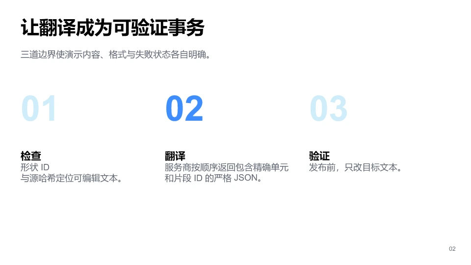
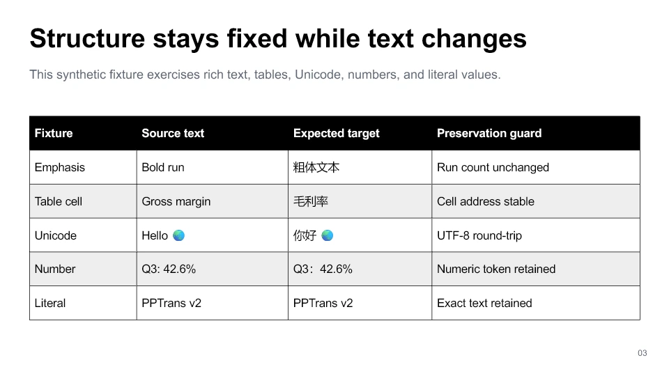
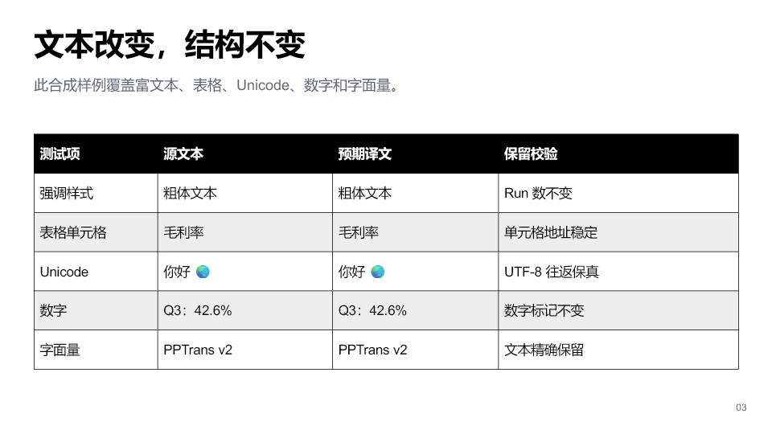

# Showcase demo source and QA

[`examples/pptrans-demo.en.pptx`](../examples/pptrans-demo.en.pptx) is a three-slide synthetic fixture for exercising the v2 pipeline without private presentation data, a network call, or an API key. It has two deliberately separate evidence paths:

- the built-in `identity` adapter returns source text unchanged and proves the no-op transaction; and
- [`examples/pptrans-demo.zh-CN.pptx`](../examples/pptrans-demo.zh-CN.pptx) uses a fixed, author-reviewed mapping to prove real changed-text patching and preservation.

The curated target is not a production-provider or general translation-quality benchmark. Its value is reproducibility: [`scripts/build_curated_demo.py`](../scripts/build_curated_demo.py) routes every mapped string through the real exact-ID translation orchestration, transactional writer, and post-write verifier.


The preview is the first slide exported by the authoring runtime. It is useful for repository presentation and visual inspection, but it does not prove pixel identity with Microsoft PowerPoint or cover the other two slides.

## Complete before / after

| Slide | English source | Curated Simplified Chinese target |
| --- | --- | --- |
| 1 |  |  |
| 2 |  |  |
| 3 |  |  |

These repository previews come from `@oai/artifact-tool` 2.8.52 importing the committed PPTX files. The separately committed LibreOffice images below are the native-application acceptance result.

## Inspectable native LibreOffice evidence

| Slide | English source | Curated Simplified Chinese target |
| --- | --- | --- |
| 1 |  |  |
| 2 |  |  |
| 3 |  |  |

These six 1921 × 1080 PNGs are the exact LibreOffice outputs pinned by the two QA records below, not conversions of the WebP previews. The normal test suite decodes every image and checks its dimensions and SHA-256 against those records. Identity images are not duplicated in the repository because each one is byte-identical to its English source image.

[`scripts/reproduce_native_demo.py`](../scripts/reproduce_native_demo.py) provides the independent replay path. It validates the English and curated deck hashes, rebuilds the identity output through the real offline transaction, requires the exact LibreOffice and PyMuPDF versions, renders all three decks, checks all nine native outputs, checks the six committed PNGs, and writes a deterministic manifest. It refuses an existing output directory and makes no provider/API request. The invoked LibreOffice process is not placed under an OS-level network sandbox; use a network-isolated disposable VM for untrusted decks or when hard egress prevention is required.

The recorded Windows build can be obtained from the [official LibreOffice 26.8.0.3 archive](https://downloadarchive.documentfoundation.org/libreoffice/old/26.8.0.3/win/x86_64/LibreOffice_26.8.0.3_Win_x86-64.msi). Verify the 374,906,880-byte MSI before extraction: its SHA-256 must be `4aa6c6e1895f4055104effcb556bd3362d20c6ad707c149543304f395ef9db95`. One disposable Windows replay is:

```powershell
python -m pip install -e ".[review]" "PyMuPDF==1.28.2"
msiexec.exe /a LibreOffice_26.8.0.3_Win_x86-64.msi /qn TARGETDIR=C:\pptrans-lo-audit
python scripts/reproduce_native_demo.py `
  --libreoffice C:\pptrans-lo-audit\program\soffice.exe `
  --output-dir .tmp-native-evidence
```

Exact PNG hashes are intentionally scoped to that recorded Windows, LibreOffice, PyMuPDF, and DPI combination. A different platform or renderer version should receive its own evidence record rather than replacing this one silently.

## Committed evidence

[`tests/test_public_demo.py`](../tests/test_public_demo.py) runs the committed deck through inspection, identity translation, source-guarded patch construction, staged writing, verification, and an independent `python-pptx` reopen. [`tests/test_repository_scripts.py`](../tests/test_repository_scripts.py) additionally binds the six committed native PNGs to the two recorded QA manifests. The current fixture contract is:

- 3 slides;
- 41 translation units;
- 45 translatable spans;
- no inspection warnings;
- 41 verified patches and 45 verified spans; and
- core metadata identifying Hehan Zhao and describing the deck as synthetic.

The same test deterministically rebuilds the curated zh-CN deck byte for byte. It verifies 41 patches / 45 spans, confirms that only the three planned slide XML members changed, re-inspects the result, matches every resulting span to the reviewed mapping, and reopens the output independently.

Document properties are normalized by [`scripts/sanitize_demo_metadata.py`](../scripts/sanitize_demo_metadata.py):

| Property | Committed value |
| --- | --- |
| Creator / last modified by | `Hehan Zhao` |
| Title | `PPTrans v2 - verifiable OOXML translation demo` |
| Subject | `Synthetic fixture for PPTrans inspection, patching, and verification` |
| Description | `Author-owned synthetic content; contains no customer or private presentation data.` |
| Created / modified | `2026-08-28T00:00:00Z` |
| Application / format / slides | `PPTrans demo generator` / `Widescreen` / `3` |

This removes tool-default metadata; it is not a general metadata scrubber for arbitrary presentations.

## Native LibreOffice identity acceptance

The demo received a separate native acceptance run on Windows at commit `37733faf71e660737177ff991be2a8437c9a6858`. The source deck first completed the offline `identity` transaction with translation memory disabled. The 18,687-byte output had the same SHA-256 as its source (`dd36b4f92edf915942d4300aeebd1854a049acc521dfc29e78b286c774d8e9d8`), so the no-op transaction was package-byte-identical.

Both packages were then opened through PPTrans's renderer using an administratively extracted, disposable copy of LibreOffice 26.8.0.3 (`bce0998afefdbc355585ca324285661a2170ba77`) and PyMuPDF 1.28.2 at 144 DPI. The result was three 1921 × 1080 PNGs per deck. Every source/identity pair had the same file SHA-256 and an empty pixel difference. All three source renders were inspected at original resolution with no visible clipping, overlap, or off-slide content, and the padded-canvas overflow check also passed. The three unique source renders are now committed above and can be recreated with the replay script.

The run additionally verified that neither the private render workspace nor publication staging remained and that no LibreOffice helper process survived success. The complete environment, distribution digest, package hashes, per-slide dimensions and hashes, comparison flags, and scope are in the [machine-readable record](qa/2026-08-28-windows-libreoffice.json).

This result is intentionally narrow. It proves that one synthetic fixture and its identity output opened and rendered identically in the recorded LibreOffice environment. It does not measure translation quality, longer-text layout fit, provider behavior, other decks, other LibreOffice versions, or Microsoft PowerPoint pixel identity.

## Native LibreOffice changed-text acceptance

The curated zh-CN output received a second acceptance run at commit `9589fb0fb6ce9ad767c6f1b9e05915d8dd96774f`. Its deterministic offline generator made 41 verified patches / 45 verified spans across exactly `slide1.xml`, `slide2.xml`, and `slide3.xml`. ZIP member order remained equal, every other package member remained byte-identical, and PPTrans reverified changed-slide structure plus planned and unplanned text nodes.

The English and zh-CN decks were then rendered with the same LibreOffice 26.8.0.3 build, PyMuPDF 1.28.2, Windows environment, and 144 DPI settings used for the identity record. Each produced three 1921 × 1080 PNGs. Every target render was inspected at original resolution with no visible clipping, overlap, or off-slide content. The Presentations skill's padded-canvas harness also passed all three target slides using its documented 100 px margin check. No private renderer workspace, publication staging directory, or LibreOffice helper process remained after the clean run. All six unique source/target PNGs are committed above and their exact hashes are enforced in tests.

The [changed-text machine-readable record](qa/2026-08-28-curated-zh-cn.json) pins the generator, tested commit, package and preview hashes, exact changed members, native render hashes, overflow method, visual review, and evidence scope. This proves one reviewed fixture in one environment. It does not establish arbitrary translation quality, fit for longer target text, or Microsoft PowerPoint pixel equivalence.

## Authoring source

[`scripts/build_demo.mjs`](../scripts/build_demo.mjs) contains the complete slide-authoring source. It uses Codex's bundled `@oai/artifact-tool` runtime to generate the raw deck, per-slide PNGs, per-slide layout JSON, an inspection snapshot, and the first-slide WebP preview.

[`scripts/build_curated_demo.py`](../scripts/build_curated_demo.py) contains the complete reviewed EN → zh-CN fixture mapping and builds the committed target through PPTrans itself. [`scripts/render_demo_comparison.mjs`](../scripts/render_demo_comparison.mjs) imports both committed decks and emits the six repository previews plus disposable PNG/layout/inspection evidence.

The authoring package is deliberately not a PPTrans runtime or Python development dependency. The build command therefore works only in an environment where the bundled `@oai/artifact-tool` module is already resolvable; the repository does not claim that this package can be installed from a public npm registry. The committed `.pptx` remains testable with PPTrans and `python-pptx` without that authoring runtime.

In a compatible Codex workspace, after making the bundled module resolvable according to that workspace's dependency setup, rebuild into a fresh disposable directory rather than over the committed fixture:

```bash
node scripts/build_demo.mjs .tmp-demo/pptrans-demo.raw.pptx .tmp-demo/qa
python scripts/sanitize_demo_metadata.py .tmp-demo/pptrans-demo.raw.pptx .tmp-demo/pptrans-demo.en.pptx
pptrans inspect .tmp-demo/pptrans-demo.en.pptx --source en --target en --fail-on-warnings
python scripts/build_curated_demo.py .tmp-demo/pptrans-demo.en.pptx .tmp-demo/pptrans-demo.zh-CN.pptx
python -m pytest -q --no-cov tests/test_public_demo.py tests/test_repository_scripts.py
```

Review every generated PNG and its corresponding layout JSON for clipping, overlap, or off-slide content before replacing a committed artifact. Then rerun the full applicable gates in [QUALITY_GATES.md](QUALITY_GATES.md). Generated QA directories are review evidence, not runtime inputs, and should not be committed unless the repository explicitly chooses to retain a particular artifact such as the preview.

## Scope and provenance

The v2 demo content and authoring source are maintained as an author-owned synthetic fixture. That fact does not resolve the separate imported-code provenance and licensing ambiguity recorded in [`NOTICE.md`](../NOTICE.md). Do not use the demo's provenance as evidence that the entire Git history is cleared for redistribution or release.
