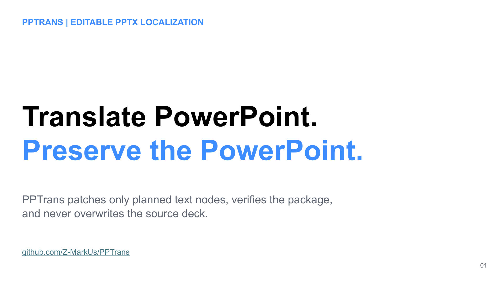
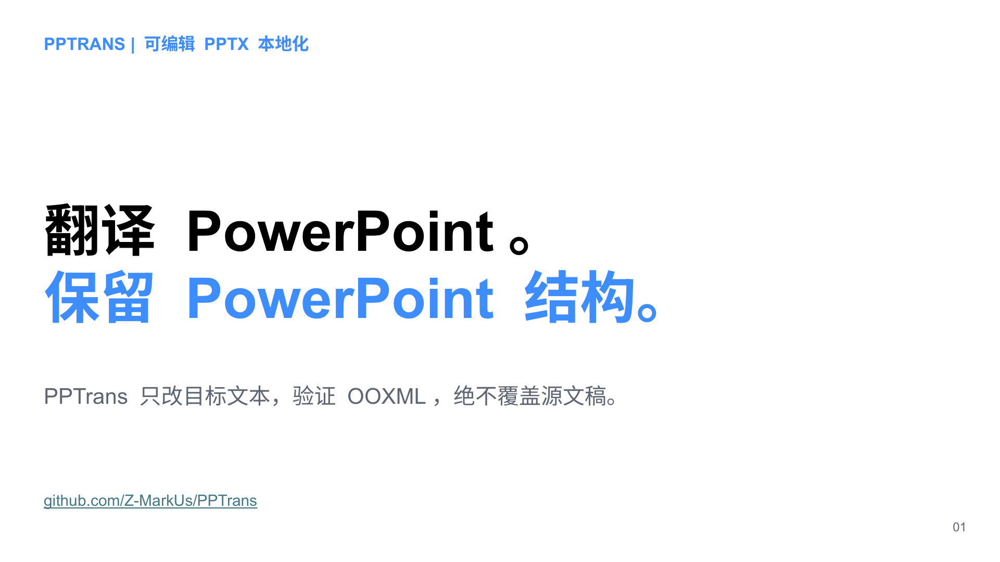
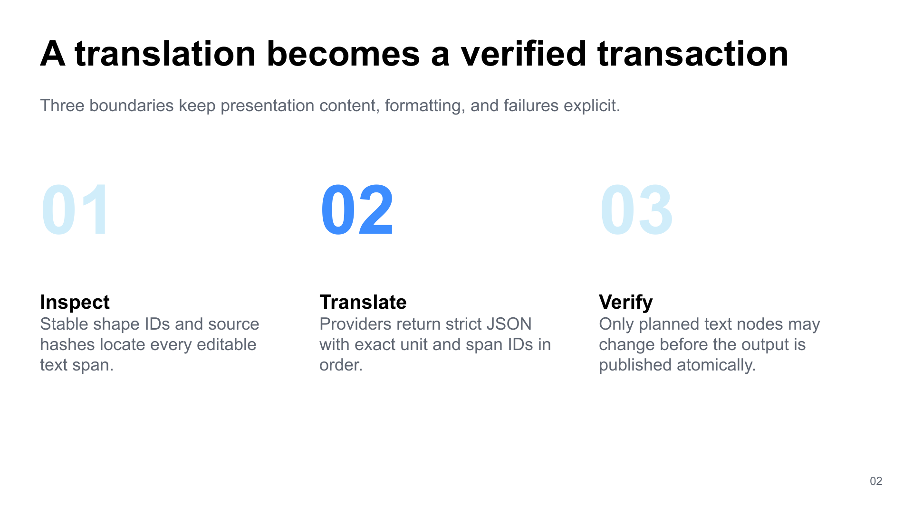
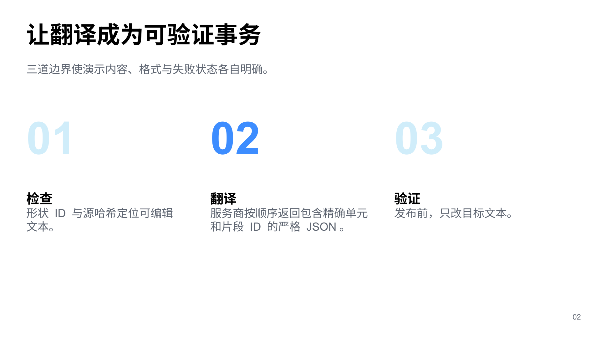
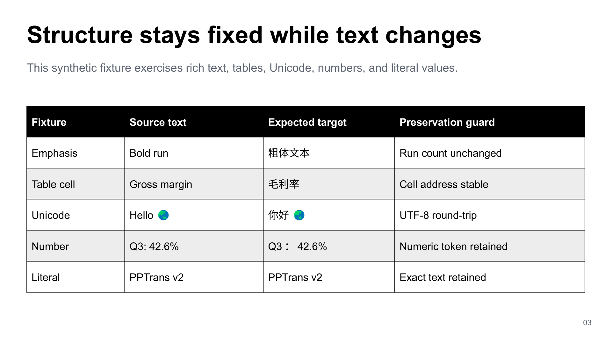
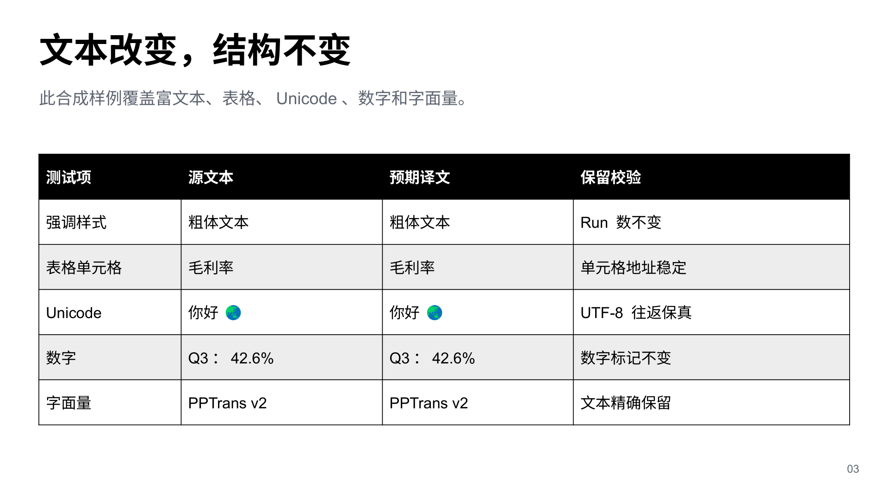

# Showcase demo source and QA

[`examples/pptrans-demo.en.pptx`](../examples/pptrans-demo.en.pptx) is a three-slide synthetic fixture for exercising PPTrans without private presentation data, a provider call, or an API key. [`examples/pptrans-demo.zh-CN.pptx`](../examples/pptrans-demo.zh-CN.pptx) applies a fixed, author-reviewed mapping through the real exact-ID transaction. It demonstrates changed OOXML and preservation behavior; it is not a production translation-quality benchmark.

## Standard-library exact rebuild

Exact rebuilding of the English fixture no longer depends on a private authoring runtime. Its complete, UTF-8 canonical package source lives under [`examples/pptrans-demo.source/`](../examples/pptrans-demo.source/manifest.json). The manifest pins all 29 OOXML members, their order, byte counts, SHA-256 digests, timestamps, permissions, and archive fields.

[`scripts/rebuild_demo.py`](../scripts/rebuild_demo.py) uses only the Python standard library. It validates paths, inventory, symlinks, line endings, sizes, and hashes before writing a fixed `ZIP_STORED` package. Stored entries deliberately avoid zlib-version drift; [ECMA-376](https://ecma-international.org/publications-and-standards/standards/ecma-376/) permits uncompressed ZIP members in Open Packaging Convention packages. Git attributes force LF for the source tree and binary handling for `.pptx` files.

Rebuild into a new path or verify the committed fixture exactly:

```bash
python scripts/rebuild_demo.py .tmp-demo/pptrans-demo.en.pptx
python scripts/rebuild_demo.py --check
```

The committed source deck is 87,523 bytes with SHA-256 `07cd8af375046b7d22a5cd53723324b4a2a219097922d8f1854b742cb9af956d`. `--check` rebuilds into a disposable directory and requires byte identity. Local Windows checks produced that exact package on Python 3.10.11, 3.12.13, and 3.13.15; the CI configuration repeats the check in every configured Python and operating-system compatibility job.

The canonical tree is exact package source, not a high-level slide-design language. It makes the shipped fixture independently rebuildable and reviewable without claiming that direct OOXML editing is convenient or that the repository-wide provenance gate is cleared. The tree contains no media or embedded fonts. Its package payloads are identical to the earlier synthetic fixture; only deterministic ZIP storage changed.

## Real changed-text rebuild

[`scripts/build_curated_demo.py`](../scripts/build_curated_demo.py) contains the complete reviewed EN → zh-CN mapping. It inspects the rebuilt English deck, validates that its vocabulary matches exactly, routes the mapping through PPTrans's normal orchestration and transactional writer, and verifies the result:

```bash
python scripts/build_curated_demo.py \
  examples/pptrans-demo.en.pptx \
  .tmp-demo/pptrans-demo.zh-CN.pptx
```

The committed target is 86,874 bytes with SHA-256 `d64338c9883927dbb32851f48a6e91e833d8ac719fb347cb27ea522107ffa88c`. Tests require a byte-identical rebuild, exactly three changed slide XML members, and byte identity for every other package member.

## Inspectable native LibreOffice evidence

| Slide | English source | Curated Simplified Chinese target |
| --- | --- | --- |
| 1 |  |  |
| 2 |  |  |
| 3 |  |  |

These are the six exact 1921 × 1080 native renders from the current exact-rebuild acceptance record—not browser or authoring-tool previews. Every source/target image was inspected at original resolution after repackaging. No clipping, unintended overlap, broken wrapping, or off-slide content was found. The three identity renders are not duplicated because each is pixel- and file-identical to its source render.

[`scripts/reproduce_native_demo.py`](../scripts/reproduce_native_demo.py) validates both package hashes, rebuilds the identity transaction, requires the recorded LibreOffice and PyMuPDF versions, renders all three decks, verifies all nine PNGs, checks the six committed assets, and writes a deterministic evidence manifest. It refuses an existing output directory and makes no provider/API request. LibreOffice itself is not placed under an OS-level network sandbox; use an isolated disposable VM when hard egress prevention is required.

The recorded build is available from the [official LibreOffice 26.8.0.3 archive](https://downloadarchive.documentfoundation.org/libreoffice/old/26.8.0.3/win/x86_64/LibreOffice_26.8.0.3_Win_x86-64.msi). Verify the 374,906,880-byte MSI and SHA-256 `4aa6c6e1895f4055104effcb556bd3362d20c6ad707c149543304f395ef9db95` before extraction:

```powershell
python -m pip install -e ".[review]" "PyMuPDF==1.28.2"
msiexec.exe /a LibreOffice_26.8.0.3_Win_x86-64.msi /qn TARGETDIR=C:\pptrans-lo-audit
python scripts/reproduce_native_demo.py `
  --libreoffice C:\pptrans-lo-audit\program\soffice.exe `
  --output-dir .tmp-native-evidence
```

The [current machine-readable record](qa/2026-08-31-exact-rebuild.json) pins both builder scripts, the native replay script, the canonical source manifest, previous-package lineage, current packages, transaction counts, exact LibreOffice distribution/build, PyMuPDF version, DPI, every PNG hash and dimension, visual review, cleanup, and evidence scope. The older [identity](qa/2026-08-28-windows-libreoffice.json) and [changed-text](qa/2026-08-28-curated-zh-cn.json) records remain immutable historical observations of the earlier compressed containers. Their retired private-runtime WebP preview paths are historical metadata, not current repository evidence.

## Fixture contract

[`tests/test_demo_rebuild.py`](../tests/test_demo_rebuild.py) checks the canonical inventory, exact package bytes, fixed ZIP fields, archive integrity, no-clobber behavior, verified overwrite staging, symlink rejection, and source-tamper failures. [`tests/test_public_demo.py`](../tests/test_public_demo.py) exercises the committed decks through inspection, identity translation, changed-text patching, verification, and an independent `python-pptx` reopen. [`tests/test_repository_scripts.py`](../tests/test_repository_scripts.py) binds the committed native PNGs to the current acceptance contract.

The fixture remains:

- 3 slides;
- 41 translation units;
- 45 translatable spans;
- no inspection warnings;
- 41 verified patches and 45 verified spans;
- exactly `slide1.xml`, `slide2.xml`, and `slide3.xml` changed in the curated output; and
- author-written synthetic slide content and reviewed mapping with no customer presentation data.

Canonical document properties remain:

| Property | Value |
| --- | --- |
| Creator / last modified by | `Hehan Zhao` |
| Title | `PPTrans v2 - verifiable OOXML translation demo` |
| Subject | `Synthetic fixture for PPTrans inspection, patching, and verification` |
| Description | `Author-owned synthetic content; contains no customer or private presentation data.` |
| Created / modified | `2026-08-28T00:00:00Z` |
| Application / format / slides | `PPTrans demo generator` / `Widescreen` / `3` |

## Evidence boundary

This evidence proves exact reconstruction and one reviewed offline transaction for one synthetic deck. It does not establish arbitrary translation quality, longer-text fit, universal PowerPoint compatibility, or Microsoft PowerPoint pixel identity. Raster hashes are intentionally scoped to the recorded Windows, LibreOffice, PyMuPDF, font environment, and DPI.

The slide content, design, and reviewed translation mapping are synthetic. The canonical OOXML payloads were preserved from the earlier private-runtime-generated package rather than independently reauthored. Neither that package source nor the demo evidence resolves the separate imported-history provenance and upstream-licensing ambiguity in [`NOTICE.md`](../NOTICE.md). Do not use this fixture as evidence that the entire repository is cleared for redistribution or release.
